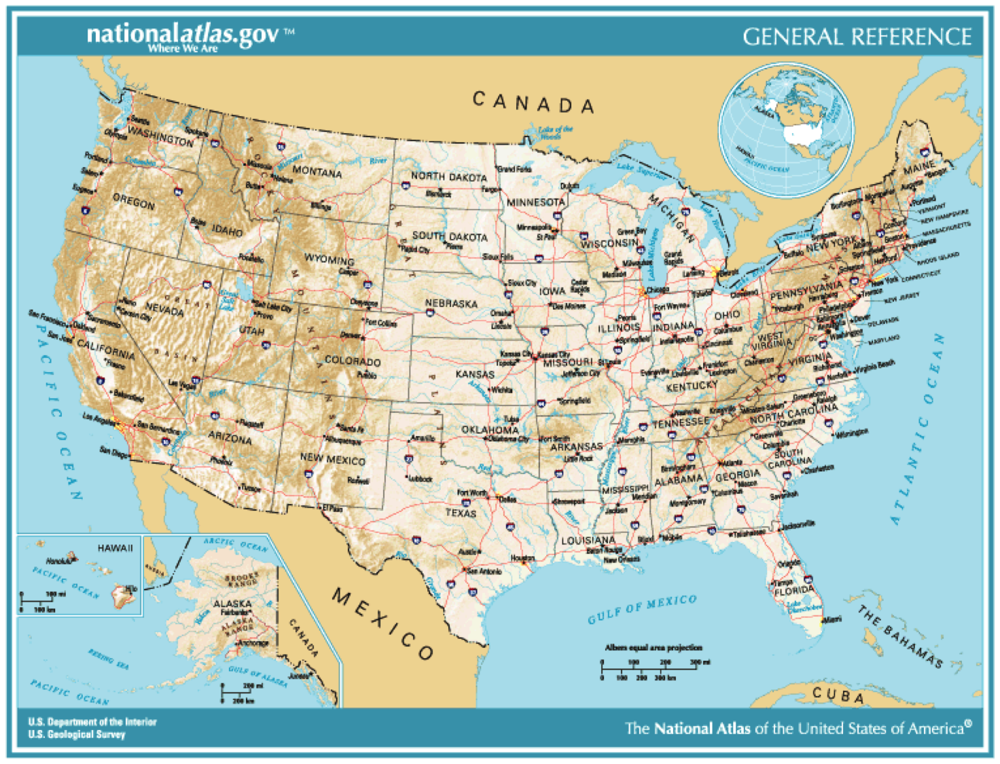
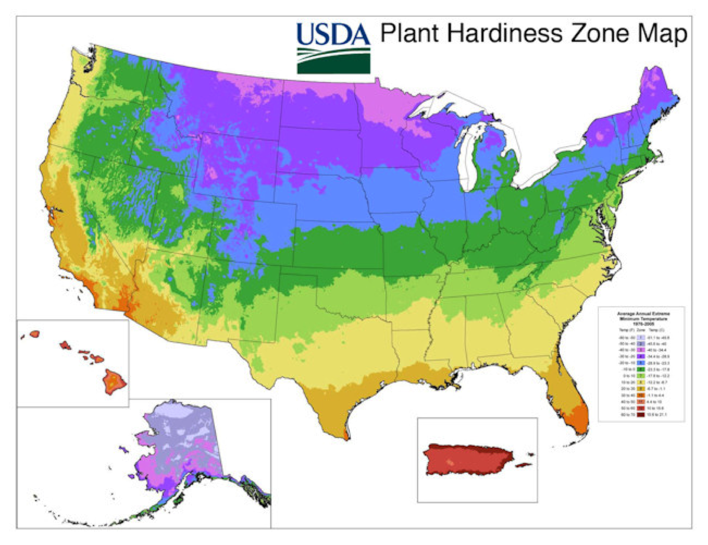
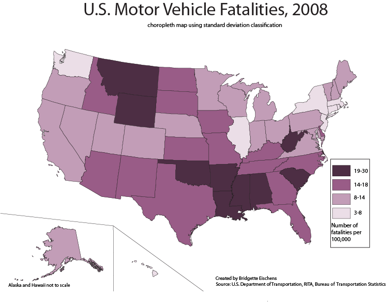
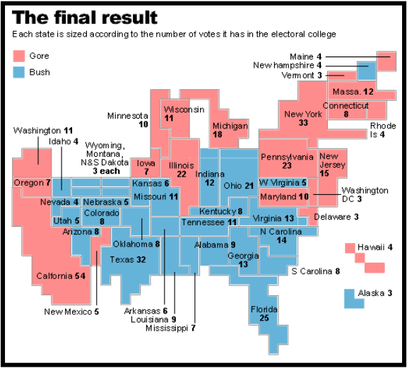
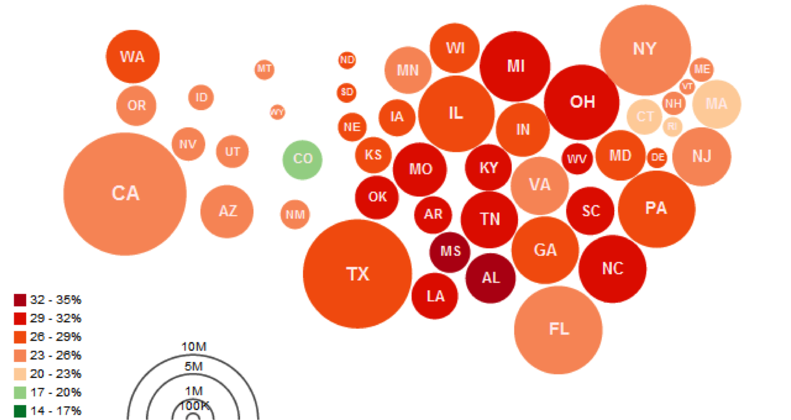

layout:true

Open Source Mapping by <a xmlns:cc="http://creativecommons.org/ns#" href="https://www.datapolitan.com" property="cc:attributionName" rel="cc:attributionURL">Richard Dunks</a> is licensed under a <a rel="license" href="http://creativecommons.org/licenses/by-nc-sa/4.0/">Creative Commons Attribution-NonCommercial-ShareAlike 4.0 International License</a>.

---

class: center

- - -
# Open Source Mapping
## Richard Dunks
## Follow along at: https://data-guest-lectures.github.io/open-source-mapping/
### The code for this presentation is here:  https://github.com/data-guest-lectures/open-source-mapping

---

# Goals for this morning
--

+ Quickly review of different types of maps and discuss their use
--

+ Provide a survey of common mapping tools
--

+ Discuss the difference between open-source and proprietary software as it relates to GIS and mapping
--

+ Practice using an online, interactive webmapping service (CARTO) to create a simple interactive map using open data

---

class: center, middle
# Why Do We Create Maps?

---

class:center,middle
# Types of Maps

---

# General Reference Maps

--

+ Show important physical features of an area
--

+ Include natural and man-made features
--

+ Usually meant to help aid in the navigation or discovery of locations
--

+ Usually fairly simple
--

+ Can be stylized based on the intended audience (tourists vs locals)

---

---

# Thematic Maps

--

+ Focuses on a specific theme or subject area
--

+ Features on the map represent the phenomenon being mapped
--

+ Spatial features used for reference
---

##### Source: http://www.usna.usda.gov/Hardzone/ushzmap.html 

---

# Choropleth

##### Source: http://www.geogalot.com/myp-humanities/year-9/understanding-hazards/003---choropleth-mapping

---

# Choropleth

##### Source: http://www.floatingsheep.org/2012/07/church-or-beer-americans-on-twitter.html

---

# Area Cartogram – Electoral Votes by State

##### Source: http://training.fws.gov/courses/csp/csp7203/resources/Types_of_Maps_2013.pdf 

---

# Dorling Cartogram – Obesity by State

##### Source: http://homes.cs.washington.edu/~jheer//files/zoo/ 

---

# The Tools

---

# ArcGIS

[Source](http://www.esri.com/news/arcuser/1012/a-workflow-for-creating-and-sharing-maps.html)

---

# Google Earth

---

# Google Fusion Tables
<iframe width="100%" height="430" scrolling="no" frameborder="no" src="https://www.google.com/fusiontables/embedviz?q=select+col54%2C+col55+from+1dNtdy7FuBBZ2qTxX7jgZ5Dig8n96oxRrWFjuhYpJ+where+col3+%3E%3D+0+and+col3+%3C%3D+4+and+col26+%3D+2+limit+1000&amp;viz=HEATMAP&amp;h=true&amp;lat=40.844685&amp;lng=-73.915349&amp;t=1&amp;z=12&amp;l=col54&amp;y=2&amp;tmplt=2&amp;hmd=true&amp;hmg=%2366ff0000%2C%2393ff00ff%2C%23c1ff00ff%2C%23eeff00ff%2C%23f4e300ff%2C%23f4e300ff%2C%23f9c600ff%2C%23ffaa00ff%2C%23ff7100ff%2C%23ff3900ff%2C%23ff0000ff&amp;hmo=0.6&amp;hmr=26&amp;hmw=0&amp;hml=TWO_COL_LAT_LNG"></iframe>
Source: [NYC Open Data 311 Noise Complaints, 1 Jan - 20 May 2014, Between Midnight and 4 am in the Bronx](https://www.google.com/fusiontables/DataSource?docid=1dNtdy7FuBBZ2qTxX7jgZ5Dig8n96oxRrWFjuhYpJ# map:id=3)

---

class:center,middle
# Proprietary vs Open-Source

---

# What is open-source?

Source: https://www.apertus.org/opensource  This work is licensed under a <a rel="license" href="http://creativecommons.org/licenses/by/3.0/">Creative Commons Attribution 3.0 Unported License</a>.

---

# What is open-source?
--

+ Free to download
--

+ Free to use
--

+ Able to change and customize
--

+ Usually no enterprise support
--

+ Supported by a community

--

---

# Proprietary software
--

+ Pay to download
--

+ Pay to use (usually with a license)
--

+ Not able to change or customize (legally)
--

+ Usually supported by a team of paid developers

---

class:center,middle
# Examples of Open Source Mapping Software

---

# [QGIS](http://www.qgis.org/)

Source: [NYC Open Data Portal 311 Service Requests](https://data.cityofnewyork.us/Social-Services/311-Service-Requests-from-2010-to-Present/erm2-nwe9), DOT Responsible Agency 1 January - 30 June 2015

---

# [Carto](https://carto.com/)
<iframe width="100%" height="480" frameborder="0" src="https://richard-datapolitan.carto.com/viz/c0d4f39e-962e-11e4-9b3b-0e9d821ea90d/embed_map" allowfullscreen webkitallowfullscreen mozallowfullscreen oallowfullscreen msallowfullscreen></iframe>

<!--  -->

---

# Disclaimer
--

## I'm a [CARTO Partner](https://carto.com/partners/)
--

## But this isn't a sales session, merely an opportunity to share the technology with Columbia students

---
class:center,middle
# So Let's Create a Map

---

# Getting Set-up
1. Go to https://carto.com
2. Register for an account
3. Download the exercise data ([311_Noise_20150601_20150830.csv](data/311_Noise_20150601_20150830.csv))
4. Drag and drop it into your dashboard

---

# An example of what you can do
<iframe width="100%" height="480" frameborder="0" src="https://richard-datapolitan.carto.com/viz/bb1e6638-b324-11e5-bf15-0ef7f98ade21/embed_map" allowfullscreen webkitallowfullscreen mozallowfullscreen oallowfullscreen msallowfullscreen></iframe>
<!--  -->

---

# Thank You
+ [richard@datapolitan.com](mailto:richard@datapolitan.com)
+ http://blog.datapolitan.com
+ [@rdunks1](https://twitter.com/rdunks1)/[@datapolitan](https://twitter.com/Datapolitan)
